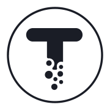

    

# Tgrade
Tgrade is a public, permissionless blockchain designed with decentralisation at its heart.

## Get started
- before you run `$ yarn start:local` make sure to have connection to blockchain via Docker or Digital Ocean

### Sentry issues

When a production deployment of this app throws an error, it's captured by [Sentry](https://sentry.io/welcome/). Every captured error can be seen on this dashboard: https://sentry.io/organizations/confio/issues/?project=5647042

### E2E tests

> E2E tests is using opensource framework called Cypress https://docs.cypress.io/guides/overview/why-cypress

##### Usage
- `$ cy:open:local` // will open "Test runner" to run on https://dev.tgrade.finance/
- `$ cy:open:dev` // to run on http://localhost:3000/

the same rules applied for running tests in Circleci more details in workflows:
[.circleci/config.yml](.circleci/config.yml)

### Integration tests
- `$ yarn test` // to run tests locally
- `$ yarn test:coverage` // generate test coverage

